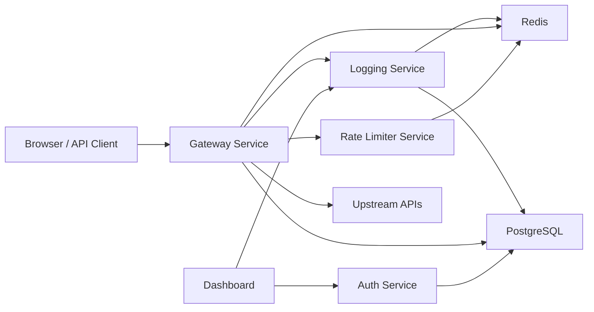

# Architecture

## Core Decisions

### Node.js + Express monorepo
- Chosen for fast service startup, simple containerization, and shared runtime across gateway/control-plane services.
- Trade-off: less strict compile-time guarantees than full TypeScript, but the code offsets that with schema validation and strong modular boundaries.
- Scalability: each service can scale horizontally behind a load balancer with Redis/Postgres as shared state.

### PostgreSQL for tenancy and analytics rollups
- Chosen because relational integrity matters for organizations, users, APIs, keys, memberships, and billing.
- Trade-off: raw event storage in Postgres must be indexed carefully at scale.
- Scalability: request rollups reduce dashboard query cost; raw event retention can be tiered later.

### Versioned migrations and auditable control-plane changes
- Chosen so schema evolution can happen safely across environments instead of relying only on container init SQL.
- Trade-off: deployment flow now needs an explicit migration step.
- Scalability: audit logs make security reviews and operator change tracking much easier as the product grows.

### Redis for distributed coordination
- Chosen because rate limiting, caching, async queues, and low-latency metric fan-out all need shared ephemeral state.
- Trade-off: operational dependence on Redis availability.
- Scalability: atomic Lua scripts and BullMQ make the critical write path horizontally safe across gateway replicas.

### Gateway-centric request flow
- Chosen to centralize key auth, per-key policies, caching, retries, circuit breaking, and observability.
- Trade-off: the gateway becomes the most performance-sensitive component and needs careful instrumentation.
- Scalability: stateless gateway instances can scale out; breaker state can later move to Redis if cross-instance sharing is required.

### Async logging pipeline
- Chosen so request latency is not dominated by analytics writes.
- Trade-off: metrics are near-real-time rather than strictly synchronous.
- Scalability: BullMQ decouples ingestion from persistence and alerting.

### Incident-aware alerting
- Chosen so one noisy failure window creates one active incident instead of an alert storm.
- Trade-off: alerts are intentionally rate-limited and may not emit repeated notifications during cooldown.
- Scalability: Redis-backed incident keys keep deduplication fast across high event volume.

## Request Lifecycle

1. Client calls `gateway-service` with `x-api-key`.
2. Gateway authenticates the API key and ensures it matches the target API slug.
3. Gateway asks `rate-limiter-service` to evaluate the configured strategy.
4. Gateway checks Redis cache for eligible GET requests.
5. Gateway forwards to the upstream with timeout, retries, and circuit breaker controls.
6. Gateway emits an async request event to `logging-service`.
7. Logging service persists logs, updates rollups, triggers alerts, and pushes live metrics over WebSocket.
8. Management operations write audit-log records so privileged actions can be reviewed later.
