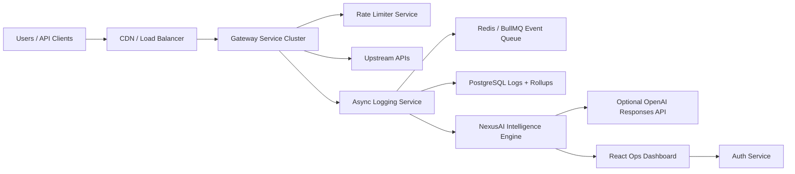

# NexusAI Gateway

NexusAI Gateway is an AI-powered cloud-native API platform built around a production-style gateway, async observability pipeline, distributed rate limiting, and AI-assisted operations.

## What Changed

The platform now includes a local intelligence engine in `logging-service`:

- anomaly detection from recent traffic, error rate, and p95 latency
- AI log debugging summaries for slow and failing request clusters
- optional OpenAI Responses API root-cause explanations when `OPENAI_API_KEY` is configured
- predictive gateway replica recommendations
- smart cache TTL recommendations for GET-heavy APIs
- adaptive rate-limit policy recommendations

The engine is deterministic and local by default. This keeps demos reliable and makes the system easy to test. When `OPENAI_LOG_ANALYSIS_ENABLED=true` and `OPENAI_API_KEY` is set, the same `/dashboard/intelligence` contract also returns OpenAI-powered root-cause analysis.

## Architecture

## Recruiter-Facing Highlights

- Built a multi-service API management platform with JWT auth, API keys, distributed rate limiting, retries, circuit breakers, caching, async logging, and WebSocket metrics.
- Added an AI operations layer that analyzes live telemetry for anomaly detection, root-cause summaries, cache optimization, adaptive throttling, and predictive scaling recommendations.
- Added optional OpenAI log debugging with deterministic fallback for reliable offline demos.
- Added Prometheus/Grafana monitoring config and request trace propagation.
- Added Kubernetes manifests with stateless service replicas, internal service discovery, health probes, and HorizontalPodAutoscaler examples.
- Added load-test profiles with k6 to validate gateway throughput, throttling, failure handling, and alert behavior.

## AI Feature Contract

`GET /dashboard/intelligence`

Returns:

- `summary`: human-readable platform assessment
- `anomaly`: traffic drift score and severity
- `scaling`: recommended gateway replicas and pressure score
- `cache`: ranked API cache candidates
- `logDebug`: likely cause, recommendation, and evidence events
- `adaptivePolicy`: protective or balanced rate-limit recommendation
- `openaiAnalysis`: optional LLM-generated root-cause summary and action list

## Honest Scalability Story

This project does not claim real 1M production users. It demonstrates the engineering needed for that direction:

- stateless gateway replicas
- Redis-backed shared rate limiting and queueing
- Postgres rollups instead of querying every raw event
- Kubernetes HPA examples
- k6 benchmark scripts
- Prometheus/Grafana dashboards
- W3C `traceparent` propagation through backend services
- live operational intelligence from telemetry

That is the right portfolio story: scalable architecture, measured behavior, and production-aware tradeoffs.
